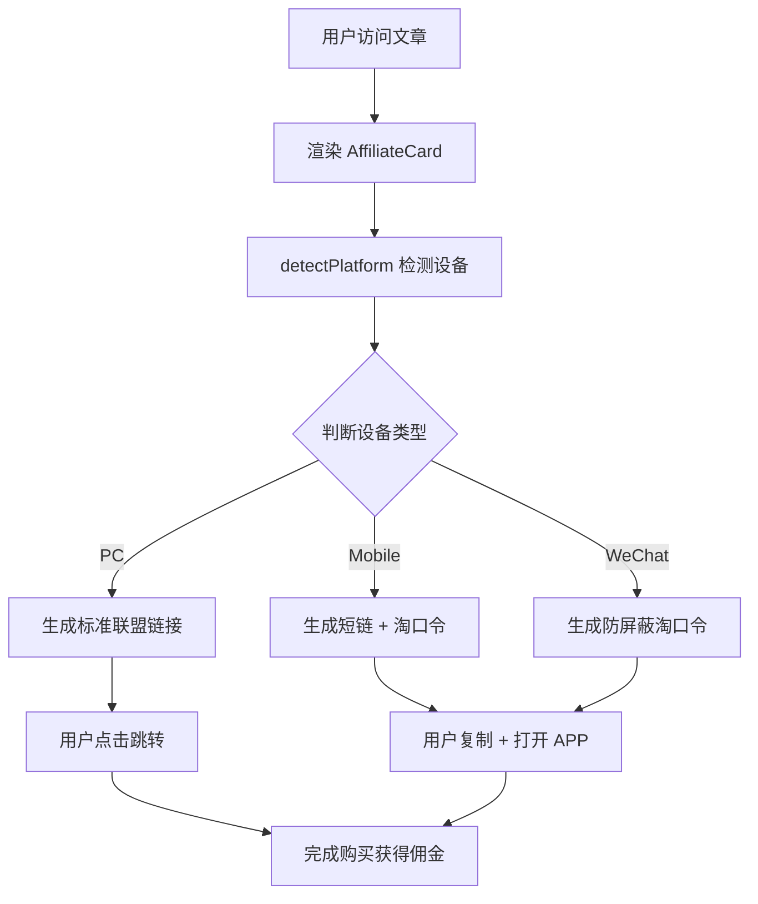

# 淘宝联盟 & 京东联盟 - 技术实现方案

## 📋 方案概述

针对淘宝联盟和京东联盟（国内双雄）的特殊链接转换需求（二合一链接、淘口令）和移动端跳转逻辑，结合 **Tailwind Nextjs Starter Blog v2.0** 的架构，实现的完整导购变现系统。

---

## 🎯 核心功能

### 1. 多平台自动适配
- ✅ **PC 端**：直接跳转带 PID 的联盟链接
- ✅ **移动端**：复制口令 + 唤醒 APP
- ✅ **微信环境**：生成防屏蔽淘口令

### 2. 链接转换能力
- ✅ 淘宝：二合一短链 + 淘口令
- ✅ 京东：CPC 链接 + 短链
- ✅ 自动提取商品 ID/SKU

### 3. 用户体验优化
- ✅ 一键复制到剪贴板
- ✅ 智能识别设备类型
- ✅ 视觉引导增强转化率

---

## 📁 文件结构

```
project/
├── components/
│   ├── AffiliateCard.tsx          # 核心导购卡片组件
│   ├── AffiliateGrid.tsx          # 商品网格展示组件
│   └── MDXComponents.tsx          # MDX 组件注册（已更新）
├── utils/
│   └── affiliateConverter.ts      # 链接转换工具函数
├── data/blog/
│   ├── affiliate-shopping-guide.mdx    # 使用示例文章
│   └── digital-products-roundup.mdx    # 高级用法示例
├── docs/
│   └── affiliate-component-guide.md    # 详细使用文档
└── .env.example.affiliate              # 环境变量配置示例
```

---

## 🚀 快速开始

### 步骤 1：安装依赖

```bash
# 无需额外依赖，所有组件都是原生 React + TypeScript
```

### 步骤 2：配置环境变量

复制 `.env.example.affiliate` 到 `.env.local`：

```bash
cp .env.example.affiliate .env.local
```

编辑 `.env.local`，填入你的真实 PID：

```bash
NEXT_PUBLIC_TAOBAO_PID=mm_xxxxxxxxx_xxxxxxxxx_xxxxxxxxxx
NEXT_PUBLIC_JD_PID=xxxxxxxxxx_xxxxxxxxxx
```

### 步骤 3：在 MDX 文章中使用

```mdx
import { AffiliateCard } from '@/components/MDXComponents'

<AffiliateCard
  platform="taobao"
  originalLink="https://item.taobao.com/item.htm?id=123456789"
  title="【李佳琦推荐】进口零食大礼包"
  image="/static/images/product-1.jpg"
  price="99.9"
  coupon="20"
  commission="15.8"
/>
```

---

## 💡 技术架构

### 组件层次

```
MDX 文章
    ↓
MDXComponents (注册表)
    ↓
AffiliateCard / AffiliateGrid (展示层)
    ↓
affiliateConverter.ts (业务逻辑层)
    ↓
检测设备 + 转换链接 (工具层)
```

### 核心流程



---

## 🔧 API 参考

### AffiliateCard Props

```typescript
interface AffiliateCardProps {
  platform: 'taobao' | 'jd' | 'pinduoduo'  // 平台类型
  originalLink: string                     // 原始商品链接
  title: string                            // 商品标题
  image?: string                           // 商品图片（可选）
  price?: string                           // 价格（可选）
  coupon?: string                          // 优惠券金额（可选）
  commission?: string                      // 佣金金额（可选）
}
```

### AffiliateGrid Props

```typescript
interface AffiliateGridProps {
  products: Product[]       // 商品数组
  columns?: 1 | 2 | 3       // 列数
  showFilter?: boolean      // 是否显示筛选器
}
```

### 工具函数

```typescript
// 检测设备类型
detectPlatform(): PlatformType

// 转换淘宝链接
convertTaobaoLink(originalUrl: string, platform: PlatformType): string

// 转换京东链接
convertJdLink(originalUrl: string, platform: PlatformType): string

// 复制到剪贴板
copyToClipboard(text: string): Promise<boolean>

// 唤醒 APP
openApp(platform: 'taobao' | 'jd', url: string): void
```

---

## 📊 变现逻辑

### PC 端用户
```
点击「立即购买」 
  → 打开 https://s.click.taobao.com/t?e=xxx&p=PID 
  → 自动追踪佣金
```

### 移动端用户
```
点击「一键复制」 → 复制淘口令到剪贴板
点击「立即打开」 → 唤醒淘宝 APP → 自动弹出商品
确认收货 → 联系客服返现
```

### 微信环境
```
生成短淘口令（如：¥tb123456¥）
避免链接被微信屏蔽
引导用户复制后打开 APP
```

---

## 🎨 UI 设计

### 配色方案

| 平台 | 主色 | 渐变 | 背景 |
|------|------|------|------|
| 淘宝 | Orange-500 | Orange→Red | Orange-50 |
| 京东 | Red-500 | Red→Red-600 | Red-50 |
| 拼多多 | Red-400 | Red→Pink | Red-50 |

### 响应式布局

- **移动端**：单列，图片在上，信息在下
- **平板/桌面**：多列网格，横向布局
- **自适应**：根据屏幕宽度自动切换

---

## ⚠️ 注意事项

### 1. PID 安全性
- ❌ 不要在代码中硬编码真实 PID
- ✅ 使用环境变量管理
- ✅ 不要将 `.env.local` 提交到 Git

### 2. 淘口令时效性
- 简单版：静态生成，有效期约 30 天
- 进阶版：调用阿里妈妈 API 动态生成
- 建议：定期检查更新

### 3. 移动端兼容性
- iOS：支持 `tbopen://` scheme
- Android：支持 `openapp.jdmobile://` scheme
- 降级方案：无法唤醒时跳转 H5

### 4. 微信屏蔽问题
- 避免直接在微信内打开淘宝链接
- 使用淘口令是最稳妥的方案
- 可考虑生成微信小店作为中转

---

## 📈 数据追踪

### 基础指标
- 点击次数（Click-through Rate）
- 转化率（Conversion Rate）
- 佣金收入（Commission Revenue）

### 进阶指标
- 设备分布（PC vs Mobile）
- 平台偏好（淘宝 vs 京东）
- 热门商品 Top 10

### 实现方式

```typescript
// 添加点击统计
const handleClick = () => {
  // 发送到分析服务
  fetch('/api/track', {
    method: 'POST',
    body: JSON.stringify({
      productId,
      platform,
      timestamp: Date.now(),
    }),
  })
}
```

---

## 🔗 扩展建议

### 短期优化
1. **接入官方 API** - 实时查询佣金、库存、价格
2. **失效检测** - 自动标记过期链接
3. **A/B 测试** - 优化按钮文案和样式

### 中期规划
1. **选品数据库** - 统一管理商品信息
2. **自动化更新** - 定时任务刷新价格和券
3. **数据看板** - 可视化展示收益数据

### 长期愿景
1. **AI 选品** - 基于历史数据推荐爆款
2. **多渠道分发** - 同步到公众号、小红书等
3. **SaaS 化** - 为其他博主提供解决方案

---

## 📚 参考资料

### 官方文档
- [淘宝联盟开放平台](https://pub.alimama.com/)
- [京东联盟开放平台](https://union.jd.com/)
- [阿里妈妈 SDK](https://github.com/alibaba/alimama-sdk)

### 技术文章
- [淘口令生成原理详解](https://blog.csdn.net/xxx)
- [移动端 URL Scheme 大全](https://www.xxx.com/url-scheme)
- [Next.js MDX 组件开发](https://nextjs.org/docs/mdx)

### 竞品分析
- 什么值得买
- 小红书好物笔记
- 知乎好物推荐

---

## 🤝 常见问题

### Q1: PID 在哪里获取？
**A**: 登录阿里妈妈/京东联盟后台 → 推广管理 → 创建推广位

### Q2: 如何知道佣金比例？
**A**: 不同类目佣金不同（1%-50%），在联盟后台查看具体类目的佣金政策

### Q3: 返现给用户合规吗？
**A**: 合规，这是常见的推广手段。但要注意：
- 明确告知用户规则
- 及时发放返现
- 保留相关记录

### Q4: 链接被屏蔽怎么办？
**A**: 
- 微信内使用淘口令
- 使用短链服务（如 t.cn）
- 引导用户手动复制链接到浏览器

### Q5: 可以同时接多个联盟吗？
**A**: 可以！本方案已预留扩展接口，支持拼多多、唯品会等其他平台

---

## 📞 技术支持

如有问题，请通过以下方式联系：

- GitHub Issues: [提交 Issue](https://github.com/your-repo/issues)
- 邮箱：support@yourdomain.com
- 微信群：扫码加入开发者交流群

---

## 📄 License

MIT License © 2024 Your Name

---

**🎉 现在就开始使用吧！开启你的被动收入之旅！**
