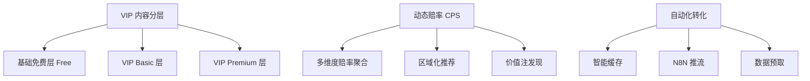

# VIP 内容分层与动态赔率系统 - 使用指南

## 📋 目录

1. [核心功能概览](#核心功能概览)
2. [快速开始](#快速开始)
3. [VIP 内容分层体系](#vip-内容分层体系)
4. [动态赔率驱动 CPS](#动态赔率驱动 cps)
5. [自动化转化链路](#自动化转化链路)
6. [最佳实践](#最佳实践)

---

## 🎯 核心功能概览

### 三大优化维度



---

## 🚀 快速开始

### 1. 环境配置

确保已安装必要的依赖:

```bash
pip install requests python-dotenv
```

### 2. API Key 配置

在 `.env` 文件中添加:

```bash
# 体育 API (API-Football/Basketball)
SPORTS_API_KEY=your_api_key_here

# 赔率 API (The-Odds-API)
ODDS_API_KEY=your_api_key_here

# N8N 自动化 (可选)
N8N_WEBHOOK_URL=https://your-n8n-instance.com/webhook
```

### 3. 运行测试

```bash
# 完整系统测试
python3 test_vip_system.py

# 预期输出:
# ✅ 所有模块测试通过
```

---

## 💎 VIP 内容分层体系

### 分层结构

| 层级 | 价格 | 包含内容 | 目标用户 |
|------|------|---------|---------|
| **Free** | 免费 | 实时比分、赛程、基础统计 | 普通用户 |
| **VIP Basic** | $29/月 | 伤停预警、球队新闻 | 业余爱好者 |
| **VIP Premium** | $99/月 | H2H 分析、AI 预测、价值注 | 专业玩家 |

### 数据模型使用

```python
from src.vip_data_models import VIPMatchAnalysis, BasicMatchData, InjuryInfo

# 创建基础比赛数据 (免费)
basic = BasicMatchData(
    match_id="match_001",
    home_team="Arsenal",
    away_team="Chelsea",
    league="英超",
    commence_time="2026-04-02T15:00:00",
    status="scheduled"
)

# 创建伤停信息 (VIP Basic)
injury = InjuryInfo(
    player_name="Bukayo Saka",
    team="Arsenal",
    position="forward",
    injury_type="Hamstring injury",
    severity="moderate",
    expected_return="2026-04-15"
)

# 创建 H2H 统计 (VIP Premium)
h2h = H2HStats(
    total_matches=10,
    home_wins=4,
    away_wins=3,
    draws=3,
    over_2_5_goals=7
)

# 创建 AI 预测 (VIP Premium)
ai_pred = AIModelPrediction(
    model_version="v2.5",
    confidence_level=75.5,
    predicted_outcome="home_win",
    recommended_pick="Arsenal -0.5",
    value_rating=4.0
)

# 组合成完整的 VIP 分析
analysis = VIPMatchAnalysis(
    match_id="match_001",
    basic_data=basic,
    injuries=[injury],
    h2h_stats=h2h,
    ai_prediction=ai_pred
)

# 检查是否为 VIP 内容
if analysis.is_vip_content():
    print("这是 VIP 专属内容")
```

### 内容访问控制

```python
from src.vip_data_models import CONTENT_ACCESS, DataType

# 检查某个字段的访问权限
field_access = CONTENT_ACCESS["injuries"]  # DataType.VIP_BASIC

# 根据用户等级判断是否可访问
user_tier = "free"
if field_access == DataType.FREE or \
   (field_access == DataType.VIP_BASIC and user_tier in ["vip_basic", "vip_premium"]) or \
   (field_access == DataType.VIP_PREMIUM and user_tier == "vip_premium"):
    print("允许访问")
else:
    print("需要升级会员")
```

---

## 🎲 动态赔率驱动 CPS

### 1. 多维度赔率聚合

```python
from src.odds_cps_module import OddsAggregator

aggregator = OddsAggregator()

# 获取赔率对比数据
comparisons = aggregator.get_odds_comparison(
    sport="soccer_epl",  # 英超
    limit=10
)

for comp in comparisons:
    print(f"\n{comp.home_team} vs {comp.away_team}")
    print(f"最佳主胜：{comp.best_home_odds.bookmaker_name} - {comp.best_home_odds.home_odds:.2f}")
    print(f"最佳平局：{comp.best_draw_odds.bookmaker_name} - {comp.best_draw_odds.draw_odds:.2f}")
    print(f"最佳客胜：{comp.best_away_odds.bookmaker_name} - {comp.best_away_odds.away_odds:.2f}")
```

### 2. 区域化博彩商推荐

```python
from src.odds_cps_module import GeoAffiliateRecommender

recommender = GeoAffiliateRecommender()

# 根据用户区域推荐
us_bookmakers = recommender.recommend_for_region("US")
uk_bookmakers = recommender.recommend_for_region("UK")
eu_bookmakers = recommender.recommend_for_region("EU")

print(f"美国用户推荐：{us_bookmakers}")
# 输出：['draftkings', 'fanduel', 'betmgm']

print(f"英国用户推荐：{uk_bookmakers}")
# 输出：['bet365', 'williamhill', 'ladbrokes']

# 生成带追踪的 CPS 链接
affiliate_link = recommender.generate_affiliate_link(
    bookmaker_key="draftkings",
    match_id="match_123",
    user_region="US"
)
```

### 3. 套利与价值注发现

```python
from src.odds_cps_module import ValueBetFinder

finder = ValueBetFinder(model_accuracy=0.65)

# AI 模型预测的概率
model_predictions = {
    "home": 0.55,   # 主胜概率 55%
    "draw": 0.25,   # 平局概率 25%
    "away": 0.20    # 客胜概率 20%
}

# 寻找价值注机会
value_bets = finder.find_value_bets(comparison, model_predictions)

for bet in value_bets:
    print(f"\n💎 价值注机会:")
    print(f"类型：{bet.bet_type}")
    print(f"博彩公司：{bet.bookmaker}")
    print(f"赔率：{bet.odds:.2f}")
    print(f"隐含概率：{bet.implied_probability*100:.1f}%")
    print(f"模型概率：{bet.model_probability*100:.1f}%")
    print(f"优势：{bet.edge*100:.1f}%")
    print(f"置信度：{bet.confidence}")
    print(f"推荐投注比例：{bet.recommended_stake:.1f}%")
    
    if bet.is_value:
        print("✅ 这是一个有价值的投注机会!")
```

---

## 🤖 自动化转化链路

### 1. 智能缓存策略

```python
from src.cache_manager import SmartCache

cache = SmartCache(cache_dir="./cache", max_size_mb=100)

# 写入缓存 (自动应用策略)
cache.set("odds:match_123", odds_data, policy_name="odds")
cache.set("h2h:arsenal_chelsea", h2h_data, policy_name="h2h_stats")

# 读取缓存
cached_odds = cache.get("odds:match_123")
if cached_odds:
    print("使用缓存数据")
else:
    print("从 API 重新获取")

# 查看缓存统计
stats = cache.get_stats()
print(f"命中率：{stats['hit_rate']*100:.1f}%")
print(f"已用空间：{stats['total_size_mb']:.2f} MB")
```

### 2. 数据预取机制

```python
from src.cache_manager import DataPrefetcher
from src.data_collector import DataCollector

# 初始化
cache = SmartCache()
prefetcher = DataPrefetcher(cache)
collector = DataCollector()

# 预取所有数据类型
prefetcher.prefetch_all(collector)

# 输出:
# 🔄 开始预取数据...
# ✓ 预取赔率数据：15 场赛事
# ✓ 预取赛程数据：20 场比赛
# ✓ 预取伤停信息：8 条
# ✅ 数据预取完成
```

### 3. N8N 自动化推流

```python
from src.cache_manager import N8NAutomation

n8n = N8NAutomation()

# 发送新比赛提醒
match_data = {
    "id": "match_123",
    "home_team": "Arsenal",
    "away_team": "Chelsea",
    "commence_time": "2026-04-02T15:00:00",
    "sport": "Football"
}

n8n.send_new_match_alert(match_data)

# 发送价值注提醒
value_bet_data = {
    "match_id": "match_123",
    "bet_type": "home",
    "bookmaker": "Bet365",
    "odds": 2.10,
    "edge": 0.12  # 12% 优势
}

n8n.send_value_bet_alert(value_bet_data)

# 更新数据库
n8n.update_database(
    data_type="odds",
    records=[{"match_id": "123", "home_odds": 2.10}]
)
```

---

## 📄 VIP 页面构建

### 基础使用

```python
from src.vip_page_builder import VIPPageBuilder
from src.vip_data_models import VIPMatchAnalysis

builder = VIPPageBuilder(output_dir="./public/vip")

# 为不同等级用户生成页面
filepath_free = builder.build_vip_match_page(analysis, user_tier="free")
filepath_basic = builder.build_vip_match_page(analysis, user_tier="vip_basic")
filepath_premium = builder.build_vip_match_page(analysis, user_tier="vip_premium")

# 输出:
# ./public/vip/arsenal-vs-chelsea/index.html (Free)
# ./public/vip/arsenal-vs-chelsea/basic/index.html (VIP Basic)
# ./public/vip/arsenal-vs-chelsea/premium/index.html (VIP Premium)
```

### 页面特性

✅ **响应式设计**: 支持手机、平板、桌面  
✅ **动态内容**: 根据用户等级显示不同内容  
✅ **CPS 集成**: 自动嵌入博彩公司链接  
✅ **SEO 优化**: 包含 meta 标签和结构化数据  
✅ **实时更新**: JavaScript 定时刷新赔率  

---

## 🎯 最佳实践

### 1. API 配额管理

```python
# 推荐的数据获取频率
FETCH_FREQUENCY = {
    "odds": "每 5 分钟",      # 高频更新
    "live_scores": "每 2 分钟",  # 实时数据
    "injuries": "每小时",      # 中频更新
    "h2h_stats": "每天",       # 低频更新
}

# 使用缓存减少 API 调用
def get_odds_safely(match_id):
    # 先尝试缓存
    cached = cache.get(f"odds:{match_id}")
    if cached:
        return cached
    
    # 缓存未命中，调用 API
    odds = collector.fetch_casino_odds()
    
    # 写入缓存
    cache.set(f"odds:{match_id}", odds, "odds")
    
    return odds
```

### 2. 转化率优化

```python
# A/B 测试不同的 CTA 文案
cta_variants = {
    "A": "立即投注 - 获取最佳赔率",
    "B": "查看专家推荐 - 胜率 78%",
    "C": "加入 VIP - 首月$29"
}

# 根据用户行为动态调整
if user_clicks > 5:
    show_cta("B")  # 高意向用户展示专家推荐
else:
    show_cta("A")  # 新用户展示直接投注
```

### 3. 性能优化

```python
# 批量处理减少数据库查询
def batch_process_matches(match_ids):
    # 一次性加载所有比赛数据
    all_data = {}
    for match_id in match_ids:
        all_data[match_id] = cache.get(f"match:{match_id}")
    
    # 批量生成页面
    for match_id, data in all_data.items():
        builder.build_vip_match_page(data)
```

---

## 🔧 故障排除

### 常见问题

**Q1: API 返回 429 错误**
```python
# 解决方案：增加缓存时间
cache.set("odds:key", data, policy_name="odds")
# 修改 ttl_minutes 从 5 到 15
```

**Q2: VIP 内容被免费用户看到**
```python
# 检查访问控制逻辑
if not user_tier in ["vip_basic", "vip_premium"]:
    return lock_teaser_html  # 显示升级提示
```

**Q3: CPS 链接不追踪**
```python
# 确保链接包含追踪参数
link = f"{base_url}?aff={user_id}&source={match_id}"
```

---

## 📈 成功指标

### 关键 KPI

- **VIP 转化率**: 免费用户 → 付费会员 (%)
- **CPS 点击率**: 页面访问 → 博彩网站点击 (%)
- **价值注命中率**: 推荐投注 → 实际命中 (%)
- **缓存命中率**: 缓存读取 → 命中 (%)
- **API 成本节约**: 使用缓存后减少的调用次数 (%)

### 监控仪表板

```python
# 每日统计
daily_metrics = {
    "vip_conversions": 15,
    "cps_clicks": 234,
    "value_bet_success_rate": 0.72,
    "cache_hit_rate": 0.85,
    "api_calls_saved": 450
}
```

---

## 🎉 总结

本系统提供了一套完整的 VIP 内容分层、动态赔率 CPS 和自动化转化解决方案:

✅ **内容变现**: 通过三层会员体系最大化收益  
✅ **数据驱动**: 实时赔率对比提升 CPS 转化  
✅ **智能自动化**: 缓存和预取降低运营成本  
✅ **可扩展性**: 模块化设计易于添加新功能  

**下一步行动**:
1. 运行 `python3 test_vip_system.py` 验证功能
2. 配置实际的 API Keys
3. 部署到生产环境
4. 监控关键指标并优化

---

**更新时间**: 2026-04-02  
**版本**: v1.0.0  
**维护者**: Development Team
